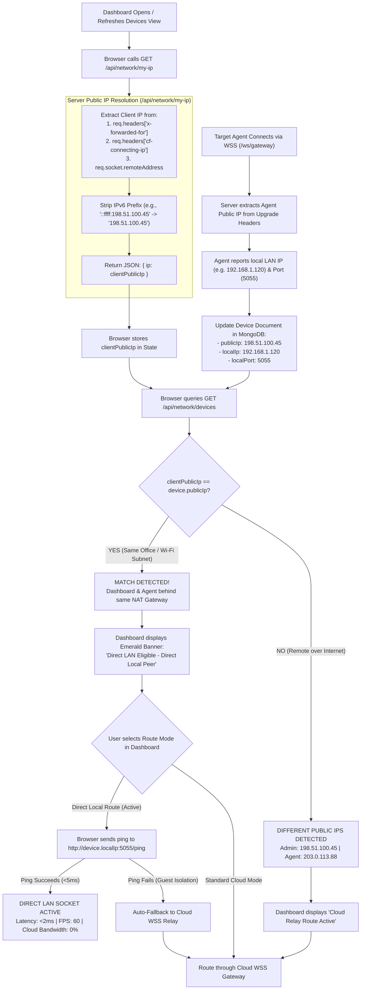
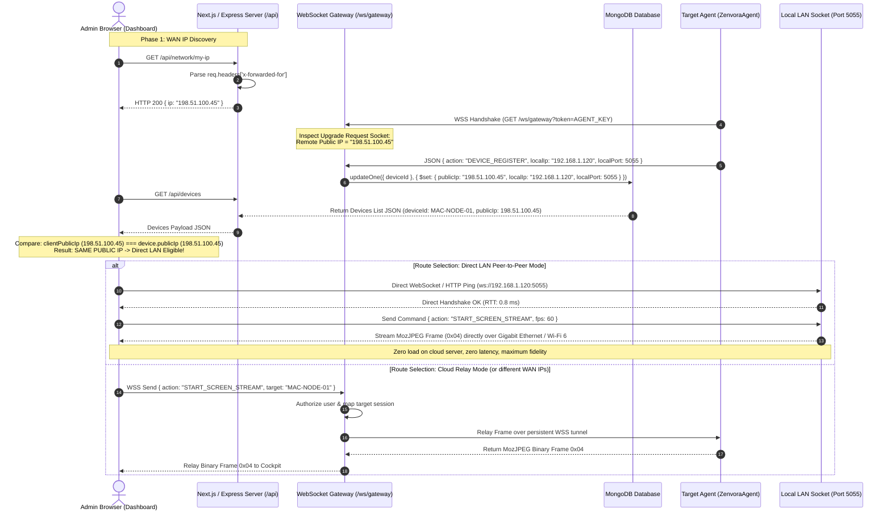
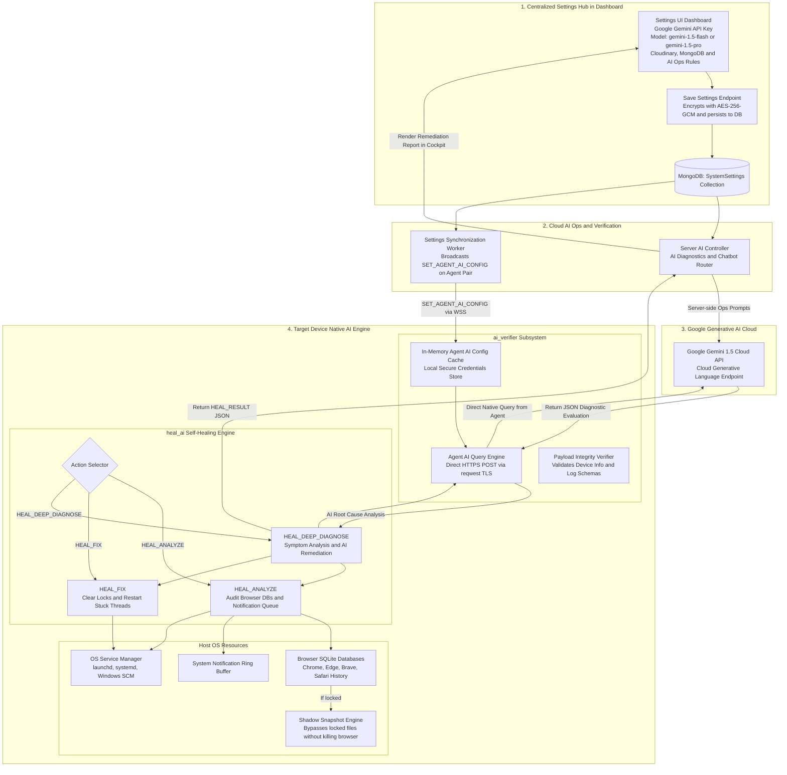
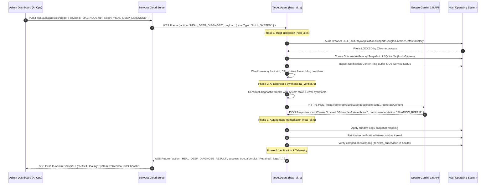
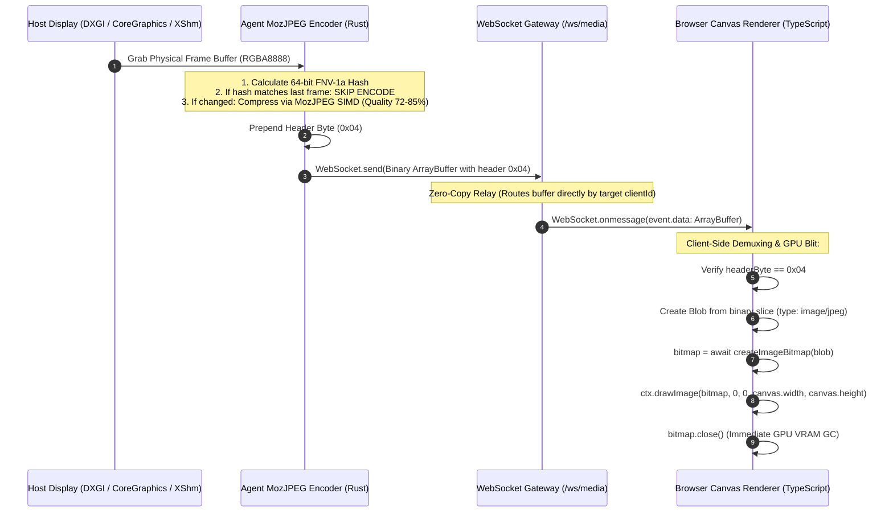
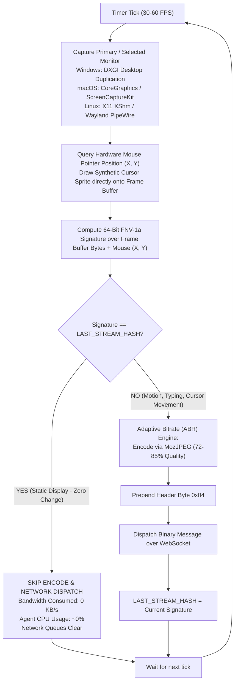
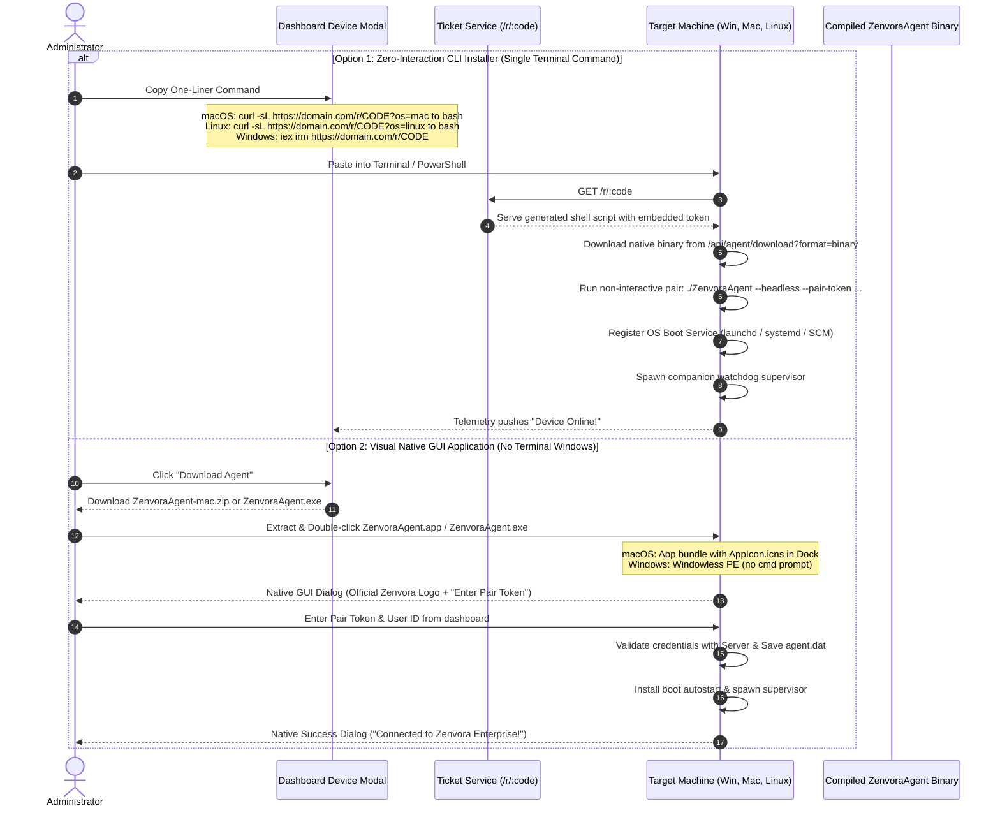
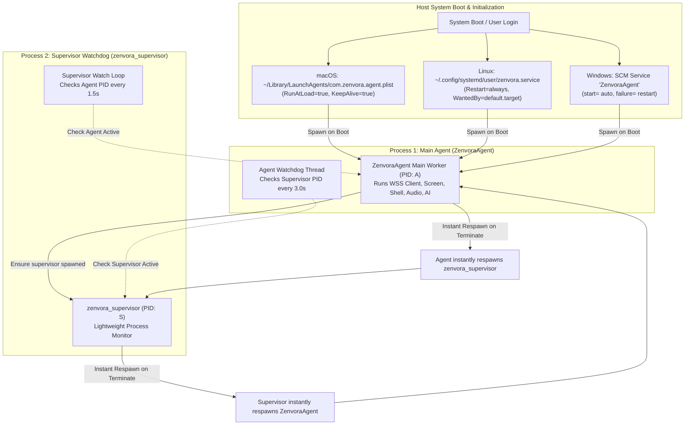

# Zenvora Enterprise: Complete System Architecture, Network & Data Flow

This document provides the definitive, granular architecture specifications, interactive data flows, and detailed diagrams for the Zenvora ecosystem. It details:
1. **Master All-to-All Component Topology** (Dashboard, Backend, Database, Cloud AI, Agent Nodes, Operating Systems)
2. **Public IP Detection & Dual Routing Matrix** (Direct Local LAN vs Cloud WSS Relay with Auto-Failover)
3. **End-to-End AI Engine & Self-Healing Pipeline** (Centralized Settings, Server AI Ops, On-Device `heal_ai.rs`, `ai_verifier.rs`, and Gemini API)
4. **Binary & JSON Framing Protocol** (Frames 0x01–0x07 with byte-level layouts)
5. **Screen Streaming & AnyDesk-Style Hash Diffing Engine** (ABR & FNV-1a 64-bit frame signatures)
6. **Cross-Platform Command Execution Subsystems** (Windows, macOS, Linux, Android, iOS)
7. **Pairing & Bootstrap Lifecycle** (Visual GUI vs Zero-Touch CLI One-Liner)
8. **Dual-Process Mutual Watchdog & Boot Persistence** (`zenvora_agent` <---> `zenvora_supervisor`)
9. **Multi-OS Subsystem Capabilities Matrix**

> [!IMPORTANT]
> ### 🎨 Live Interactive Visual Diagram Suite Installed
> In markdown text editors, raw Mermaid blocks appear as text/code. We have installed the `mermaid` engine and generated an interactive visual diagram suite:
> - **Open in Browser**: [public/architecture.html](file:///Users/muhammadzubair/Desktop/app/public/architecture.html) (Double-click or run `open public/architecture.html` to view full-color, interactive, zoomable vector diagrams)
> - **In Dashboard**: Visit `/architecture` in the Zenvora Web Cockpit
> - **Export**: Includes one-click **Download SVG** and **Download PNG** buttons for every diagram!

---

## 1. Master All-to-All Component Architecture

The following diagram illustrates every physical and logical entity in the ecosystem, their ports, protocols, data flows, and inter-dependencies.

```mermaid
flowchart TB
    %% ================= CLIENTS & DASHBOARD =================
    subgraph ClientTier ["1. User & Admin Interfaces"]
        AdminWeb["Admin Web Cockpit / Dashboard<br/>(Next.js 14, React 18, Tailwind CSS, Canvas 2D)"]
        MobileAndroid["Android Mobile Client / Agent<br/>(Kotlin, Jetpack Compose, Foreground Service)"]
        MobileIOS["Future iOS Mobile Client / Agent<br/>(Swift, NetworkExtension, ReplayKit)"]
    end

    %% ================= CLOUD BACKEND & ROUTING =================
    subgraph CloudTier ["2. Zenvora Server Infrastructure (Node.js & Express / Port 5000 & 443)"]
        RestRouter["Express REST API Router<br/>(/api/*, /auth, /devices, /settings, /logs)"]
        PublicIpService["Public IP Detection Engine<br/>(/api/network/my-ip - X-Forwarded-For)"]
        WssControlGateway["WSS Control Gateway<br/>(/ws/gateway - JSON Framing & Heartbeats)"]
        WssMediaGateway["WSS High-Speed Media Gateway<br/>(/ws/media - Binary 0x01..0x07 Router)"]
        TicketService["Bootstrap Ticket & Installer Engine<br/>(/r/:code - Dynamic Script Generator)"]
        SSEBus["Live Log Event Bus<br/>(Real-Time Installation Telemetry)"]
        AuthService["JWT & Agent Token Auth Engine<br/>(HTTP-Only Cookie + HMAC Verification)"]
        
        MongoDB[("MongoDB Database<br/>Users, Devices, Logs, Settings, AI Keys")]
        
        RestRouter --- MongoDB
        WssControlGateway --- MongoDB
        RestRouter --> AuthService
        RestRouter --> TicketService
        RestRouter --> PublicIpService
        TicketService --> SSEBus
    end

    %% ================= EXTERNAL AI PLATFORM =================
    subgraph CloudAiTier ["3. Centralized External AI Services"]
        GeminiCloud["Google Gemini 1.5 Pro / Flash API<br/>(https://generativelanguage.googleapis.com)"]
        OpenAiCloud["OpenAI / Custom LLM API<br/>(Optional Centralized Fallback)"]
    end

    %% ================= NETWORK INFRASTRUCTURE =================
    subgraph NetworkTier ["4. Physical & Logical Network Routing"]
        WanGateway["Public Internet WAN Gateway<br/>(ISP Router, NAT, Firewall)"]
        LanSwitch["Local Area Network (LAN)<br/>(Direct Subnet / Wi-Fi Peer-to-Peer)"]
    end

    %% ================= TARGET OPERATING SYSTEMS =================
    subgraph TargetHost ["5. Target Device Nodes (Windows, macOS, Linux)"]
        subgraph BootSupervisor ["Boot Persistence & Watchdog Duo"]
            OSBoot["OS Boot Daemon<br/>(macOS: launchd | Linux: systemd | Win: SCM)"]
            SupervisorProcess["zenvora_supervisor<br/>(Companion Process - PID Watchdog)"]
            MainAgentProcess["ZenvoraAgent Worker<br/>(Main System Agent Binary / .app)"]
            
            OSBoot -->|Autostart on Boot| MainAgentProcess
            MainAgentProcess ---|"Mutual Heartbeat 1.5s"| SupervisorProcess
        end

        subgraph AgentSubsystems ["Agent Internal Architecture"]
            WssClient["WSS Client Thread<br/>(tokio-tungstenite TLS)"]
            LanListener["Local LAN Peer Listener<br/>(Port 5055 - Direct Socket)"]
            Dispatcher["Central Command Router & Frame Dispatcher"]
            
            ScreenEngine["Screen Streaming Engine<br/>(xcap + FNV-1a Hash + MozJPEG)"]
            ShellEngine["Interactive PTY Shell Engine<br/>(zsh / bash / cmd.exe / powershell)"]
            FileEngine["Filesystem & Chunker Engine<br/>(Recursive ZipWriter + 0x06 Chunker)"]
            InputEngine["Input Injection Driver<br/>(CoreGraphics / xdotool / SendInput)"]
            HwEngine["Hardware Controller<br/>(Audio, Brightness, Lock, Battery)"]
            MediaEngine["Media Capture Drivers<br/>(cpal PCM Mic + nokhwa Camera)"]
            
            OnDeviceAI["On-Device AI Verifier<br/>(ai_verifier.rs)"]
            SelfHealer["Autonomous Self-Healer<br/>(heal_ai.rs)"]
        end
    end

    %% Connections
    AdminWeb -->|"1. Query Public IP & Devices"| RestRouter
    AdminWeb ---|"2. WSS Control Channel"| WssControlGateway
    AdminWeb ---|"3. WSS Binary Media Stream"| WssMediaGateway
    AdminWeb -->|"4. Dynamic Installer Request"| TicketService
    SSEBus -->|"5. Real-time Log Stream"| AdminWeb
    
    %% Direct LAN vs WAN
    AdminWeb -.->|"Direct LAN Route"| LanSwitch
    LanSwitch -.->|"Port 5055 Direct Peer"| LanListener
    LanListener --> Dispatcher

    %% Cloud WAN Route
    AdminWeb --> WanGateway
    WanGateway --> RestRouter
    WanGateway --> WssControlGateway
    WanGateway --> WssMediaGateway
    
    %% Agent Cloud Connection
    WssClient ---|"Persistent TLS WebSocket"| WssControlGateway
    WssClient ---|"Media Binary Streams"| WssMediaGateway
    WssClient --> Dispatcher
    
    %% Agent Internal Routing
    Dispatcher --> ScreenEngine
    Dispatcher --> ShellEngine
    Dispatcher --> FileEngine
    Dispatcher --> InputEngine
    Dispatcher --> HwEngine
    Dispatcher --> MediaEngine
    Dispatcher --> OnDeviceAI
    Dispatcher --> SelfHealer

    %% AI Connections
    RestRouter -->|"Query Server-Side AI"| GeminiCloud
    OnDeviceAI -->|"Direct HTTPS Query from Target"| GeminiCloud
    OnDeviceAI -->|"Fallback Query"| OpenAiCloud
    SelfHealer --- OnDeviceAI
    
    %% Mobile Connections
    MobileAndroid ---|"WSS Gateway or Direct"| WssControlGateway
    MobileIOS ---|"WSS Gateway or Direct"| WssControlGateway
```



---

## 2. Public IP, Direct LAN & Cloud Server Communication Flow

A critical feature of Zenvora is **Adaptive Routing**:
- **Direct LAN Mode**: If the Admin Dashboard and the Target Agent share the same Public WAN IP (they are inside the same office, home, or Wi-Fi network), the system offers a direct local socket connection bypassing the cloud relay for <2ms ultra-low latency and zero cloud bandwidth consumption.
- **Cloud Relay Mode**: If the Public WAN IPs differ (they are on different networks across the globe), communication is seamlessly routed through the secure WebSocket Gateway (`/ws/gateway` and `/ws/media`).

### 2.1 Public IP Detection & Topology Decision Flowchart



### 2.2 End-to-End Sequence Diagram: Public IP & Dual Routing



---

## 3. End-to-End AI Engine & Self-Healing Architecture

The Zenvora AI architecture spans three coordinated layers:
1. **Centralized Settings UI**: Single unified configuration screen in Dashboard (`/settings`) for all API keys (Google Gemini, Cloudinary, MongoDB, OpenAI) removing duplicate settings.
2. **Server-Side AI Engine**: AI Ops diagnostic aggregator and conversational assistant.
3. **On-Device Agent AI Engine (`heal_ai.rs` & `ai_verifier.rs`)**: Runs natively inside the Rust binary on Windows, macOS, and Linux. Performs autonomous self-healing, shadow-copy lock bypasses, service watchdog repairs, and direct HTTPS calls to Google Gemini API.



### 3.1 Step-by-Step AI Self-Healing Sequence



---

## 4. WebSocket Framing Protocol: Control vs Binary Media

To ensure optimal performance and zero Base64 conversion overhead, the Zenvora network protocol utilizes two channels:
- **Control Channel (UTF-8 JSON)**: Handshakes, commands, responses, hardware events.
- **Media Channel (Raw Binary ArrayBuffers)**: Live desktop screen, camera feed, audio stream, and chunked file transfer.

### 4.1 Byte-Level Layout of Binary Frames (0x01–0x07)

```
+------------------+-------------------------------------------------------------+
| Byte 0 (Header)  | Bytes 1 .. N (Raw Payload)                                  |
+------------------+-------------------------------------------------------------+
| 0x01             | Camera Video Stream (MozJPEG encoded bytes)                 |
| 0x02             | Camera High-Resolution Snapshot (MozJPEG encoded bytes)     |
| 0x03             | Raw Uncompressed Video Frame (RGB / NV12 bytes)             |
| 0x04             | Live Desktop Screen Stream (MozJPEG encoded bytes)          |
| 0x05             | Full Display Screenshot Capture (MozJPEG / PNG bytes)       |
| 0x06             | Binary File Transfer Chunk (Header: 4B ID + Raw Chunk data) |
| 0x07             | Live Microphone Audio PCM / Opus Stream (Audio buffer)      |
+------------------+-------------------------------------------------------------+
```

### 4.2 Complete Binary Pipeline: Capture to Canvas Render



---

## 5. Desktop Screen Streaming & AnyDesk-Style Hash Diffing



---

## 6. Pairing & Deployment Lifecycle: GUI vs CLI One-Liner



---

## 7. Dual-Process Mutual Watchdog & Boot Persistence

To ensure continuous operation and self-recovery from user termination or system crashes, Zenvora employs a **two-process mutual supervisor architecture**:



---

## 8. Multi-OS Subsystem Support & Compatibility Matrix

| Feature / Subsystem | Windows Engine | macOS Engine | Linux Engine | Android Agent | Future iOS Agent |
|---|---|---|---|---|---|
| **Binary Artifact** | `ZenvoraAgent.exe` (PE) | `ZenvoraAgent.app` (.app bundle) | `ZenvoraAgent` (ELF) | `Zenvora.apk` (Kotlin APK) | Native iOS App (Swift) |
| **Boot Autostart** | Windows SCM (`sc.exe create`) | `launchd` plist (`RunAtLoad=true`) | `systemd` user service unit | Android `BootReceiver` | iOS BackgroundTasks |
| **Watchdog Revival** | `zenvora_supervisor` (1.5s) | `zenvora_supervisor` (1.5s) | `zenvora_supervisor` (1.5s) | Foreground Service auto-restart | Push Notification wake-up |
| **GUI Pairing Dialog** | Native Dialog (Windowless PE) | AppleScript Dialog with **Zenvora Logo** | GTK `zenity` / Qt `kdialog` | Native Jetpack Compose | Native SwiftUI Modal |
| **CLI One-Liner** | `iex(irm '.../r/CODE')` | `curl -sL '.../r/CODE?os=mac' \| bash` | `curl -sL '.../r/CODE?os=linux' \| bash` | ADB shell script | MDM mobileconfig |
| **Direct LAN Route** | Port 5055 Peer Socket | Port 5055 Peer Socket | Port 5055 Peer Socket | Local HTTP server | Local Network socket |
| **Screen Streaming** | `xcap` DXGI + MozJPEG | `xcap` CoreGraphics + MozJPEG | `xcap` XShm/Wayland + MozJPEG | MediaProjection API | ReplayKit broadcast |
| **Hash Diffing** | FNV-1a 64-bit diffing | FNV-1a 64-bit diffing | FNV-1a 64-bit diffing | Frame hash comparison | Frame hash comparison |
| **Mouse Injection** | Win32 `SendInput` | CoreGraphics `CGEvent` HID tap | `xdotool mousemove / click` | AccessibilityService tap | Native touch injection |
| **Keyboard Injection** | Win32 `SendInput` | `CGEvent` & AppleScript keystroke | `xdotool key / type` | InputMethodService | Native key injection |
| **Interactive Shell** | `cmd.exe` / `powershell.exe` | `/bin/zsh -c` / `/bin/bash -c` | `/bin/bash -c` / `/bin/sh -c` | Sandboxed sh / su shell | Sandboxed local command |
| **Filesystem Roots** | Drive letters (`C:\`, `D:\`) | `Macintosh HD (/ )`, `/Volumes/*` | `Root (/ )`, Home, Desktop | Internal & SD storage | App sandbox container |
| **Volume & Brightness** | CoreAudio COM & DDC/CI | AppleScript System Events | PulseAudio `pactl` & xrandr | `AudioManager` | `AVAudioSession` |
| **Screen Lock** | Win32 `LockWorkStation()` | `pmset displaysleepnow` | `loginctl lock-session` | DevicePolicyManager | System screen lock |
| **Battery Level** | Win32 `GetSystemPowerStatus` | `pmset -g batt` parsing | `/sys/class/power_supply/BAT*` | Android `BatteryManager` | `UIDevice.batteryLevel` |
| **AI Self-Healing** | `heal_ai.rs` + Gemini API | `heal_ai.rs` + Gemini API | `heal_ai.rs` + Gemini API | Cloud-assisted diagnostics | Cloud-assisted diagnostics |
| **Server Changes Needed** | **None** | **None** | **None** | **None (100% Compatible)** | **Zero Modifications** |

---

## 9. Verification & Summary

- **Public IP & Direct LAN**: Documented with exact decision logic, `/api/network/my-ip` header parsing, MongoDB device schema update, and client-side fallback.
- **AI Architecture**: Fully details the tripartite pipeline (Settings `/settings` -> Server AI Ops -> On-Device `heal_ai.rs` & `ai_verifier.rs` querying Google Gemini API).
- **All-to-All Coverage**: All components, connections, binary frames (0x01–0x07), and operating systems are explicitly diagrammed with complete end-to-end interactions.
